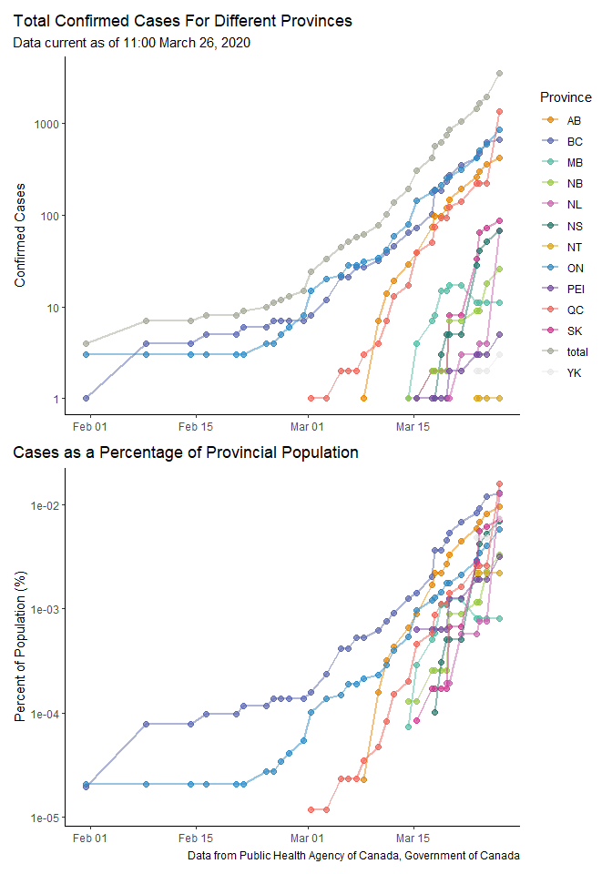

Canadian Cases of COVID-19
==========================

**Update:** A colleague just forwarded me an excellent group that is
already doing this, and have developed some great RShiny apps to
visualize the data. You can find it here:
<a href="https://art-bd.shinyapps.io/covid19canada/" class="uri">https://art-bd.shinyapps.io/covid19canada/</a>
. I would highly recommend this site as it contains more detailed and
up-to-date information. I’ll still continue to add data whenever I have
a chance, but do check out that website as they supply open-sourced data
as well.

*Previous Post:*

I was trying to find a figure illustrating the changes in COVID-19 cases
with time for Canada and its provinces. I stumbled across a few but not
any with accessible databases.

I’ve compiled data from the Government of Canada website to help see the
change in confirmed cases with time. I’ll try to keep the database
updated at least once a day (but no promises!). My hope is that anyone
who is wanting to see how things have changed with time, or try to plot
their own graphs, will have an accessible resource to do so.

Source of Data
==============

All data has been collected somewhat-daily since March from the Public
Health Agency of Canada, Government of Canada
(<a href="https://www.canada.ca/en/public-health/services/diseases/2019-novel-coronavirus-infection.html" class="uri">https://www.canada.ca/en/public-health/services/diseases/2019-novel-coronavirus-infection.html</a>).
I’ve included a shortcut to their website in this repo. As their website
states, provincial and territorial reported numbers will likely be more
up-to-date than what is found on the PHAC website. Regardless, this
gives a consistent idea of how things are changing with time.

Where Can I Find the Compiled Data?
===================================

You will find two files:  
\* canada\_covid.xlsx - Compilation of the data from the website in both
long and short form  
\* canada\_covid\_shortform.csv - A ‘.csv’ file of the above that I like
to use to make graphs

Graphs
======

Code to create these graphs can be found in the file ‘covid script.Rmd’.

Note: I chose to only focus on ‘confirmed cases’ that the PHAC website
gives. My hope is that this database helps others plot or visualize
whatever they see fit.

